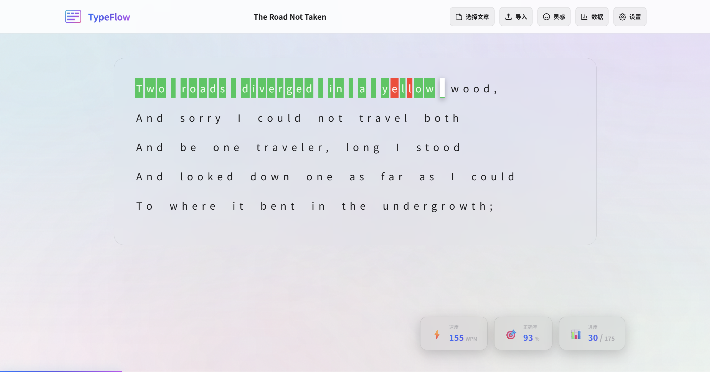

# Type Test - 打字练习平台

<p align="center">
  <a href="https://typing.zhaowumian.top" target="_blank">
    
  </a>
  <a href="#" target="_blank">
    
  </a>
  <a href="#" target="_blank">
    
  </a>
  <a href="#" target="_blank">
    
  </a>
</p>

<p align="center">
  <strong>一个现代化、功能丰富的在线打字练习平台</strong>
</p>

---

## 🚀 在线体验

**预览地址**: [https://typing.zhaowumian.top](https://typing.zhaowumian.top)

<!-- 在此处添加应用截图 -->




---

## ✨ 核心功能

### 🎯 多语言打字练习
- **中文拼音练习** - 支持汉字拼音提示，实时校验输入
- **英文打字练习** - 标准英文文章练习，提升打字速度
- **汉字专项练习** - 针对汉字输入的专项训练

### 🤖 AI 文章生成
- 基于 DeepSeek 大模型的智能文章生成
- 支持多语言内容生成（中文/英文/汉字）
- 丰富的主题模板（唐诗宋词、科幻片段、治愈语录等）
- 自定义 Prompt 模板，灵活控制生成内容
- 生成内容自动保存，支持重复使用

### 🔊 智能音效系统
- 打字音效反馈（正确/错误/删除）
- 语音播报功能（使用 speak-tts 库）
- 可自定义音效开关和音量

### 📊 数据可视化
- 实时统计打字速度（WPM/CPM）
- 准确率追踪
- 历史成绩图表展示
- 个人进步曲线分析

### 📝 文章管理系统
- 内置丰富的练习文章（古诗词、散文、英文经典）
- 支持自定义导入文章
- 中文文章自动生成拼音
- 文章数据本地存储（LocalStorage）

### 🎨 个性化设置
- 多种音效主题可选
- 语音播报开关
- 键盘映射显示
- 主题颜色自定义

---

## 🛠️ 技术栈

| 类别 | 技术 |
|------|------|
| **前端框架** | Vue 3 + Composition API |
| **类型系统** | TypeScript 5.6 |
| **构建工具** | Vite 7.3 |
| **状态管理** | Pinia 2.2 |
| **样式方案** | SCSS + CSS Variables |
| **路由管理** | Vue Router 4.4 |
| **拼音处理** | pinyin-pro |
| **语音合成** | speak-tts |
| **AI 模型** | DeepSeek API |

---

## 📦 项目结构

```
Type-test/
├── src/
│   ├── assets/                    # 静态资源目录
│   │   ├── audios/               # 音效文件
│   │   │   ├── duck.mp3          # 鸭子音效
│   │   │   ├── dog.mp3           # 狗叫音效
│   │   │   ├── koubanji.mp3      # 口扳机音效
│   │   │   ├── tengtong.mp3      # 疼痛音效
│   │   │   ├── 点击音效.mp3       # 点击音效
│   │   │   ├── 胜利号角.mp3       # 胜利音效
│   │   │   └── 街机游戏按钮.mp3    # 街机按钮音效
│   │   └── vue.svg               # Vue Logo
│   │
│   ├── components/               # Vue 组件目录
│   │   ├── typing/              # 打字练习相关组件
│   │   │   └── Practice/        # 练习模式组件
│   │   │       ├── EnglishPractice.vue    # 英文练习组件
│   │   │       ├── HanziPractice.vue      # 汉字练习组件
│   │   │       └── PinyinPractice.vue     # 拼音练习组件
│   │   ├── AIGenerator.vue      # AI 文章生成器组件
│   │   ├── ArticleImporter.vue  # 文章导入组件
│   │   ├── ArticleSelector.vue  # 文章选择器组件
│   │   ├── KeyboardMap.vue      # 键盘映射显示组件
│   │   ├── ProgressChart.vue    # 进度图表组件
│   │   ├── ResultPanel.vue      # 结果展示面板
│   │   ├── SettingsPanel.vue    # 设置面板组件
│   │   └── StatsPanel.vue       # 统计面板组件
│   │
│   ├── composables/             # 组合式函数（可复用逻辑）
│   │   ├── index.ts             # 组合式函数统一导出
│   │   ├── useAudio.ts          # 音效管理组合式函数
│   │   ├── usePinyin.ts         # 拼音处理组合式函数
│   │   ├── useSpeech.ts         # 语音播报组合式函数
│   │   ├── useStorage.ts        # 本地存储组合式函数
│   │   └── useTyping.ts         # 打字逻辑组合式函数
│   │
│   ├── data/                    # 静态数据文件
│   │   └── articles.json        # 内置文章数据（古诗词、散文等）
│   │
│   ├── router/                  # Vue Router 路由配置
│   │   └── index.ts             # 路由定义和配置
│   │
│   ├── stores/                  # Pinia 状态管理
│   │   ├── index.ts             # Store 统一导出
│   │   ├── ai.ts                # AI 生成相关状态
│   │   ├── article.ts           # 文章数据状态
│   │   ├── settings.ts          # 用户设置状态
│   │   ├── stats.ts             # 统计数据状态
│   │   └── typing.ts            # 打字练习状态
│   │
│   ├── style/                   # 全局样式文件
│   │   ├── index.scss           # 主样式入口
│   │   └── theme.scss           # 主题变量定义
│   │
│   ├── types/                   # TypeScript 类型定义
│   │   ├── index.ts             # 类型统一导出
│   │   ├── ai.ts                # AI 相关类型定义
│   │   ├── article.ts           # 文章相关类型定义
│   │   ├── settings.ts          # 设置相关类型定义
│   │   ├── speak-tts.d.ts       # speak-tts 库类型声明
│   │   └── typing.ts            # 打字相关类型定义
│   │
│   ├── utils/                   # 工具函数
│   │   ├── codeHighlight.ts     # 代码高亮工具
│   │   ├── constants.ts         # 常量定义
│   │   ├── helpers.ts           # 通用辅助函数
│   │   └── index.ts             # 工具函数统一导出
│   │
│   ├── views/                   # 页面级组件
│   │   ├── Home/                # 首页
│   │   │   └── index.vue        # 首页主组件
│   │   └── Typing/              # 打字练习页面
│   │       ├── index.vue        # 打字页面主组件
│   │       ├── TypingContent.vue    # 打字内容区域
│   │       ├── TypingHeader.vue     # 打字页面头部
│   │       ├── CompletionModal.vue  # 完成弹窗
│   │       └── CompletePage.vue     # 完成页面
│   │
│   ├── App.vue                  # 根组件
│   ├── env.d.ts                 # 环境变量类型声明
│   └── main.ts                  # 应用入口文件
│
├── public/                      # 公共静态资源
├── dist/                        # 构建输出目录
├── index.html                   # HTML 入口文件
├── package.json                 # 项目依赖和脚本
├── tsconfig.json                # TypeScript 配置
└── vite.config.ts               # Vite 构建配置
```

---

## 🚀 快速开始

### 环境要求
- Node.js 18+
- npm 9+ 或 yarn/pnpm

### 安装依赖

```bash
npm install
```

### 开发模式

```bash
npm run dev
```

应用将在 `http://localhost:5173` 启动

### 构建生产版本

```bash
npm run build
```

构建输出位于 `dist/` 目录

### 预览生产构建

```bash
npm run preview
```

---

## 📖 使用指南

### 开始练习
1. 进入首页选择练习类型（中文/英文/汉字）
2. 从文章列表中选择或导入自定义文章
3. 开始打字练习，系统会实时显示速度和准确率
4. 完成后查看详细统计和进步曲线

### 使用 AI 生成文章
1. 点击"AI 生成"按钮进入 AI 文章生成器
2. 选择语言类型（汉语拼音/英文/汉字）
3. 选择文章主题标签（唐诗宋词、科幻片段、治愈语录等）
4. 可选：自定义 Prompt 模板以生成特定内容
5. 点击"生成文章"按钮，等待 AI 生成内容
6. 生成的文章自动保存，可直接用于练习

### 导入自定义文章
1. 点击"导入文章"按钮
2. 粘贴或输入文章内容
3. 设置文章标题和作者（可选）
4. 中文文章会自动生成拼音提示

### 设置音效
1. 点击设置图标进入设置面板
2. 开启/关闭音效总开关
3. 单独控制各类音效（正确/错误/删除）
4. 开启语音播报功能

---

## 🎯 功能特性详解

### 队列式语音播报
使用 speak-tts 库实现智能队列管理：
- 连续输入时按顺序播报
- 避免语音重叠和混乱
- 支持中英文切换

### AI 文章生成系统
基于 DeepSeek 大语言模型的智能内容生成：
- **多语言支持**：根据选择的练习类型生成对应语言内容
- **主题模板**：内置丰富的主题标签，一键生成特定风格文章
- **自定义 Prompt**：支持用户自定义提示词，灵活控制生成内容
- **流式生成**：实时显示生成进度，提升用户体验
- **本地存储**：生成的文章自动保存，支持重复使用

AI 生成模块核心文件：
- `src/components/AIGenerator.vue` - AI 生成器 UI 组件
- `src/stores/ai.ts` - AI 状态管理和 API 调用
- `src/types/ai.ts` - AI 相关类型定义和主题配置

### 实时统计计算
- **WPM** (Words Per Minute) - 每分钟单词数
- **CPM** (Characters Per Minute) - 每分钟字符数
- **准确率** - 正确输入占总输入的比例
- **用时** - 实际打字时间（不含暂停）

### 数据持久化
- 练习记录自动保存到 LocalStorage
- 设置偏好记忆
- 自定义文章本地存储
- AI 生成的文章本地存储

---

## 🔧 自定义配置

### 添加新文章
编辑 `src/data/articles.json`，按以下格式添加：

```json
{
  "cnArticles": [
    {
      "id": "unique-id",
      "language": "cn",
      "title": "文章标题",
      "dynasty": "朝代",
      "author": "作者",
      "content": [
        [
          { "hanzi": "字", "pinyinTone": "pīnyīn", "pinyin": "pinyin" }
        ]
      ]
    }
  ]
}
```

### 配置 AI 生成（环境变量）

1. 复制环境变量模板：
```bash
cp .env.example .env
```

2. 编辑 `.env` 文件，填入实际配置：
```env
# AI API 密钥
# 获取方式：访问 https://platform.deepseek.com/api_keys
VITE_AI_API_KEY=your-api-key-here

# AI API 地址
VITE_AI_API_URL=https://api.deepseek.com/v1/chat/completions

# AI 模型名称
VITE_AI_MODEL=deepseek-chat
```

**配置说明**：

| 环境变量 | 说明 | 默认值 |
|---------|------|--------|
| `VITE_AI_API_KEY` | DeepSeek API 密钥（必填） | - |
| `VITE_AI_API_URL` | API 请求地址 | `https://api.deepseek.com/v1/chat/completions` |
| `VITE_AI_MODEL` | 使用的模型名称 | `deepseek-chat` |


### 自定义音效
将音频文件放入 `public/` 目录，在设置中配置对应路径。

---

<p align="center">
  Made with ❤️ for better typing experience
</p>
